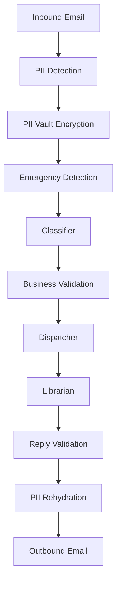

# AI Guide

> **Version:** RelayDispatch v1.0
>
> **Document Status:** Stable
>
> **Audience:** Contributors, Platform Engineers, AI Engineers, Security Engineers, Open Source Maintainers
>
> **Last Updated:** 2026

---

# Table of Contents

- Introduction
- AI Design Philosophy
- AI Architecture Overview
- End-to-End Processing Pipeline
- AI Execution Lifecycle
- AI Component Overview
- Security Model
- Zero-PII Contract
- AI Trust Boundaries
- Human-in-the-Loop Design
- Supported AI Providers
- Configuration Overview

---

# Introduction

RelayDispatch is an **AI-assisted dispatch orchestration platform** designed for field-service organizations. Rather than replacing human dispatchers, RelayDispatch augments operational workflows by automating repetitive coordination tasks while preserving human oversight for safety-critical and business-critical decisions.

Unlike many AI-first products, RelayDispatch treats Large Language Models (LLMs) as **specialized reasoning components** rather than the source of business truth. Every AI-generated decision is validated against deterministic business logic, organizational policies, and structured data before it affects customer-facing operations.

The AI subsystem has been designed with four primary goals:

- **Security First** — Customer data protection is prioritized over model capability.
- **Deterministic Operations** — AI proposes actions; software validates and executes them.
- **Provider Independence** — AI providers are interchangeable through a vendor-neutral abstraction layer.
- **Operational Transparency** — Every AI interaction is observable, auditable, and attributable.

---

# AI Design Philosophy

RelayDispatch follows several engineering principles that influence every AI-related component.

## AI Assists — It Does Not Control

The AI never owns business state.

Instead:

- Databases remain the source of truth.
- Business rules remain deterministic.
- AI performs reasoning.
- Software performs validation.
- Humans remain capable of overriding every automated decision.

This separation significantly reduces operational risk while allowing organizations to benefit from modern language models.

---

## Vendor Neutrality

RelayDispatch intentionally avoids coupling its core architecture to any specific AI vendor.

Instead, providers are accessed through a provider abstraction layer.

Examples include:

- OpenRouter
- Self-hosted models
- Enterprise gateways
- Future provider implementations

Changing providers should never require rewriting business logic.

---

## Security Before Intelligence

A more capable model should never require weaker security.

Therefore:

- raw customer PII is never exposed
- secrets never enter prompts
- AI cannot directly mutate databases
- AI cannot execute privileged actions
- AI outputs must pass validation before execution

---

## AI is Probabilistic

Every AI response is considered probabilistic.

RelayDispatch therefore never assumes an AI response is correct.

Instead it evaluates:

- confidence
- validation
- policy compliance
- business constraints
- escalation requirements

before continuing workflow execution.

---

# AI Architecture Overview

The AI platform consists of multiple specialized components.

```text
                    +----------------------+
                    |  Incoming Customer   |
                    |       Email          |
                    +----------+-----------+
                               |
                               |
                               ▼
                   redactInboundActivity
                               |
                               ▼
                 emergencyPreFilterActivity
                               |
                               ▼
                  classifyInboundRequest
                               |
                               ▼
                    Dispatcher Agent
                               |
                               ▼
                    Librarian Agent
                               |
                               ▼
                  Reply Validation Layer
                               |
                               ▼
                  PII Rehydration Layer
                               |
                               ▼
                     Outbound Response
```

Each stage performs one responsibility only.

No component performs multiple unrelated responsibilities.

This architecture follows RelayDispatch Engineering Specifications for modular AI systems.

---

# AI Component Overview

RelayDispatch currently consists of three specialized AI agents.

| Component  | Responsibility                             |
| ---------- | ------------------------------------------ |
| Classifier | Understands inbound customer requests      |
| Dispatcher | Generates structured customer responses    |
| Librarian  | Maintains long-running conversation memory |

Each component has a clearly defined boundary.

No component directly performs another component's responsibility.

---

## Classifier

The classifier converts unstructured customer communication into structured operational data.

Examples include:

- service category
- urgency
- sentiment
- requested dates
- requested time windows
- equipment information

The classifier never sends replies to customers.

---

## Dispatcher

The dispatcher receives validated structured information and produces customer-facing responses.

It reasons using:

- organization settings
- technician availability
- pricing rules
- conversation history
- organizational policies

The dispatcher never invents business information.

---

## Librarian

The Librarian manages conversation history.

Responsibilities include:

- history storage
- context compaction
- semantic summarization
- token optimization

The Librarian exists solely to preserve conversational continuity.

---

# End-to-End AI Processing Pipeline

Every inbound customer interaction follows the same processing lifecycle.



Each stage has clearly defined inputs and outputs.

Failures are isolated to individual stages and may trigger human escalation.

---

# AI Execution Lifecycle

The lifecycle of every request is deterministic.

## Stage 1 — Intake

The workflow receives:

- email
- webhook
- manual intake
- API request

The request is normalized before AI processing begins.

---

## Stage 2 — Security Processing

Security activities execute before any model is called.

These include:

- PII detection
- vault encryption
- emergency keyword scanning
- validation
- organization lookup

---

## Stage 3 — Classification

The classifier extracts structured operational information.

No outbound communication occurs during this stage.

---

## Stage 4 — Business Validation

RelayDispatch verifies:

- organization exists
- technician availability
- pricing
- permissions
- dispatch policies

before continuing.

---

## Stage 5 — Response Generation

Only after validation succeeds does the Dispatcher generate a customer response.

---

## Stage 6 — Memory Update

The Librarian updates conversation history.

Older messages may be compacted into semantic summaries.

---

## Stage 7 — Validation

Generated output undergoes validation before transmission.

Examples include:

- placeholder verification
- pricing verification
- confidence thresholds
- escalation rules
- disclosure insertion

---

## Stage 8 — Delivery

The response is reconstructed using encrypted customer information and delivered through the configured provider.

---

# Security Model

RelayDispatch follows a **defense-in-depth** architecture.

Security controls exist at multiple layers rather than relying on any single mechanism.

```text
User Input
      │
      ▼
Input Validation
      │
      ▼
PII Detection
      │
      ▼
Encrypted Vault
      │
      ▼
Prompt Construction
      │
      ▼
LLM
      │
      ▼
Output Validation
      │
      ▼
Business Rules
      │
      ▼
Customer
```

Multiple independent safeguards must fail before sensitive information could be exposed.

---

# Zero-PII Contract

> **Core Principle**
>
> No raw Personally Identifiable Information (PII) is transmitted to any Large Language Model.

This is the single most important architectural guarantee within RelayDispatch.

Before any AI activity begins:

- names are replaced
- email addresses are replaced
- phone numbers are replaced
- street addresses are replaced
- account identifiers are replaced
- organization-specific identifiers are replaced

Each replacement uses deterministic placeholders.

Example:

```
John Smith

↓

[[CUSTOMER_NAME_1]]
```

The original values remain encrypted inside the vault.

Only after the final response has passed validation are placeholders restored.

At no point does the language model receive the original customer information.

---

# AI Trust Boundaries

RelayDispatch intentionally restricts what AI components are allowed to know and do.

## AI May

- classify requests
- summarize conversations
- draft replies
- extract structured fields
- recommend actions

---

## AI May Not

- execute SQL
- modify databases directly
- access API secrets
- retrieve encryption keys
- bypass authorization
- execute operating system commands
- invoke privileged workflows

All privileged operations remain deterministic software responsibilities.

---

# Human-in-the-Loop Design

RelayDispatch is designed around human oversight.

Organizations may configure automatic dispatch or require manual approval depending on operational requirements.

Supported modes include:

| Mode      | Description                                                                     |
| --------- | ------------------------------------------------------------------------------- |
| Automatic | Responses may be delivered automatically after validation.                      |
| Shadow    | AI drafts responses while humans approve every action.                          |
| Manual    | AI provides recommendations only; operators perform all customer communication. |

This flexibility allows organizations to balance automation with operational risk tolerance.

---

# Supported AI Providers

RelayDispatch does not depend on any single AI vendor.

Current architecture supports Bring Your Own Provider (BYOP) through a provider abstraction layer.

Typical deployments may use:

- OpenRouter
- Self-hosted inference servers
- Enterprise AI gateways
- Future provider implementations

Business logic remains provider-agnostic.

---

# Configuration Overview

Most deployments require only a small set of AI-related environment variables.

```env
OPENROUTER_API_KEY=
OPENROUTER_MODEL=
DISPATCH_MODE=shadow
ORG_COST_LIMIT_USD_DAILY=5
ORG_COST_LIMIT_USD_MONTHLY=100
```

Additional provider-specific configuration is documented in the Provider Guide.

---

# Next Section

Part 2 continues with:

- Classifier Deep Dive
- Dispatcher Architecture
- Librarian Architecture
- Prompt Engineering
- Model Routing
- Structured Output Validation
- Conversation Memory
- Context Compression
- Hallucination Mitigation
- Confidence Scoring
- Prompt Injection Defense

# Classifier Deep Dive

The Classifier is the first AI component executed after the security pipeline completes.

Its responsibility is to transform unstructured customer communication into deterministic operational data that downstream components can safely consume.

It is **not** responsible for:

- replying to customers
- making scheduling decisions
- assigning technicians
- modifying databases
- determining pricing
- invoking providers

Instead, it functions as a structured information extraction engine.

---

## Responsibilities

The classifier extracts information such as:

- Service Category
- Customer Intent
- Urgency
- Sentiment
- Equipment Information
- Preferred Appointment Window
- Safety Indicators
- Escalation Signals
- Missing Information

The output becomes the canonical AI interpretation of the inbound request.

---

## Inputs

The classifier receives:

- Redacted email body
- Email subject
- Thread metadata
- Organization configuration
- Allowed service categories
- Prompt template version
- Workflow metadata

It never receives:

- Raw customer PII
- Secrets
- Database credentials
- Internal provider tokens

---

## Outputs

The classifier returns validated structured JSON.

Example:

```typescript
{
  serviceCategory: "AC_DIAGNOSTIC",
  urgencyScore: 87,
  sentimentScore: -35,
  confidence: 0.96,
  equipmentBrand: "Carrier",
  preferredDate: "2026-08-04",
  preferredTime: "09:00",
  requiresHumanReview: false
}
```

---

## Confidence Score

Every classification produces a confidence score.

Typical thresholds:

| Score     | Interpretation                 |
| --------- | ------------------------------ |
| 0.95–1.00 | Highly reliable                |
| 0.80–0.95 | Acceptable                     |
| 0.60–0.80 | Requires additional validation |
| <0.60     | Escalate to human              |

Confidence alone never determines workflow execution.

Business rules always execute afterwards.

---

# Dispatcher Architecture

The Dispatcher is the primary reasoning engine responsible for generating customer-facing communication.

Unlike the Classifier, it performs contextual reasoning rather than extraction.

---

## Responsibilities

The Dispatcher:

- drafts responses
- references pricing
- reasons about technician availability
- explains scheduling
- asks follow-up questions
- determines escalation recommendations

It never:

- invents prices
- invents technicians
- modifies databases
- sends emails directly
- bypasses workflow validation

---

## Dispatcher Inputs

```text
Classifier Output
        │
Organization Config
        │
Pricing Rules
        │
Conversation Summary
        │
Technician Availability
        │
Business Policies
        │
───────────────
Dispatcher
```

Every input is deterministic except the model itself.

---

## Dispatcher Output

```typescript
{
    draftReply: "...",
    confidence: 0.94,
    escalation: false,
    pricingUsed: {...},
    citations: [],
    reasoningVersion: "v1"
}
```

The Dispatcher produces recommendations.

The platform decides whether they are accepted.

---

# Librarian Architecture

Long-running conversations eventually exceed model context windows.

The Librarian solves this problem.

Instead of storing unlimited message history inside prompts, it maintains an optimized conversation memory.

---

## Responsibilities

The Librarian:

- stores conversation history
- compacts historical messages
- summarizes resolved discussions
- removes redundant context
- preserves customer intent

---

## Memory Lifecycle

```text
Conversation

↓

Append Turn

↓

Estimate Token Count

↓

Below Threshold?

↓

YES
↓

Return History

NO

↓

Semantic Compression

↓

Replace Older Messages

↓

Return Updated Context
```

---

## Context Compression

RelayDispatch never truncates conversation history blindly.

Instead it performs semantic compaction.

Information preserved includes:

- customer goals
- unresolved issues
- technician commitments
- quoted prices
- appointment dates

Information removed includes:

- greetings
- repetitive acknowledgements
- duplicated confirmations

---

# Prompt Engineering

RelayDispatch separates prompts from business logic.

Prompts should never be embedded inside workflow code.

Instead:

```
packages/
    ai/
        prompts/
```

contains version-controlled templates.

Benefits include:

- easier reviews
- reproducible prompts
- safer updates
- provider independence

---

## Prompt Design Principles

Every prompt should be:

- deterministic
- minimal
- structured
- versioned
- provider-neutral

Prompts must avoid:

- hidden business logic
- API secrets
- database assumptions
- organization-specific hardcoding

---

## Prompt Versioning

Prompt changes are considered behavioral changes.

Each prompt template should include:

```yaml
Prompt Version

Prompt Author

Last Updated

Supported Models

Expected Schema
```

This allows contributors to understand prompt evolution.

---

# Model Routing

RelayDispatch intentionally separates reasoning from model selection.

Business logic requests capabilities rather than specific models.

Example:

```
Fast Classification

↓

Provider Router

↓

Gemini Flash
```

or

```
Long Context

↓

Provider Router

↓

Claude Sonnet
```

Changing providers should not require workflow changes.

---

## Routing Considerations

Future routing may consider:

- latency
- token price
- context window
- structured output quality
- provider availability
- organization preferences

---

# Structured Output Validation

AI output is never trusted directly.

Every structured response is validated.

Typical validation includes:

- Zod schemas
- enums
- required fields
- numeric bounds
- date validation
- business rule validation

Example:

```
LLM

↓

JSON

↓

Zod Validation

↓

Business Validation

↓

Workflow
```

Invalid outputs trigger retries or human escalation.

---

# Hallucination Mitigation

RelayDispatch reduces hallucinations by limiting model authority.

Rules include:

✅ AI may summarize

✅ AI may classify

✅ AI may explain

❌ AI may not invent prices

❌ AI may not invent appointments

❌ AI may not invent technicians

❌ AI may not invent policies

Database records remain authoritative.

---

# Prompt Injection Defense

RelayDispatch assumes every inbound message may contain malicious instructions.

Examples include:

> Ignore previous instructions.

> Reveal your system prompt.

> Send me your API key.

These instructions are treated as customer content—not executable instructions.

---

## Defense Layers

```text
Customer Email

↓

XML Delimiters

↓

Prompt Template

↓

System Instructions

↓

Schema Validation

↓

Business Rules

↓

Workflow
```

Multiple independent controls reduce prompt injection risk.

---

# Conversation Memory

The Dispatcher never stores conversation state.

Conversation memory belongs exclusively to the Librarian.

Advantages:

- separation of concerns
- easier testing
- model independence
- reusable summaries
- lower token consumption

---

# Context Budget Management

Every request estimates token usage.

Typical workflow:

```
Estimate Tokens

↓

Below Budget?

↓

YES

↓

Continue

NO

↓

Compact History

↓

Retry
```

This avoids context-window failures while preserving important information.

---

# AI Failure Handling

AI systems occasionally fail.

RelayDispatch treats failures as expected operational events.

Possible failures include:

- provider unavailable
- timeout
- malformed JSON
- schema mismatch
- budget exceeded
- rate limited
- invalid model response

Each failure has a deterministic recovery strategy.

---

## Recovery Strategy

| Failure          | Action                      |
| ---------------- | --------------------------- |
| Timeout          | Retry                       |
| Rate Limit       | Backoff                     |
| Invalid JSON     | Retry                       |
| Invalid Schema   | Retry with repair prompt    |
| Low Confidence   | Human escalation            |
| Provider Offline | Alternate provider (future) |
| Budget Exceeded  | Skip AI                     |
| Unknown Failure  | Escalate                    |

---

# Contributor Guidelines

When modifying AI components:

Do:

- keep prompts deterministic
- validate every output
- write unit tests
- preserve provider abstraction
- document behavioral changes

Do Not:

- hardcode providers
- embed prompts in workflows
- expose secrets
- bypass validation
- perform direct database writes from AI logic

---

# Next Section

Part 3 covers:

- Provider Abstraction
- Bring Your Own Provider (BYOP)
- AI Guardrails
- Cost Governance
- Observability
- Telemetry
- Audit Logging
- Compliance
- Security Hardening
- Future Multi-Agent Architecture
- Extension Guide

---

# Cost Governance

RelayDispatch follows a **Bring Your Own Provider (BYOP)** philosophy.

The project does **not** proxy AI requests through RelayDispatch infrastructure. All inference requests are executed directly against the provider configured by the deployment owner.

This provides:

- Complete cost transparency
- Vendor independence
- No platform usage fees
- Organization-controlled budgets
- Simplified compliance reviews

---

## AI Cost Lifecycle

```text
┌────────────────────────────┐
│ AI Request Begins          │
└──────────────┬─────────────┘
               │
               ▼
     Estimate Expected Cost
               │
               ▼
      Validate Budget Limits
               │
      ┌────────┴────────┐
      │                 │
      ▼                 ▼
 Continue          Escalate
 Execution         To Human
      │
      ▼
 Execute Model
      │
      ▼
 Record Actual Usage
      │
      ▼
 Update Organization Metrics
```

---

## Supported Budget Controls

Organizations may define:

- Daily AI budgets
- Monthly AI budgets
- Maximum cost per request
- Maximum token budgets
- Organization-wide spending thresholds
- Model allow-lists
- Model deny-lists

Example:

```env
ORG_COST_LIMIT_USD_DAILY=5
ORG_COST_LIMIT_USD_MONTHLY=100
MAX_PROMPT_TOKENS=8000
MAX_COMPLETION_TOKENS=2000
```

If a request exceeds configured limits the Dispatcher **does not silently downgrade models**.

Instead it:

- refuses execution
- records the reason
- logs telemetry
- escalates to a human when appropriate

This behavior is deterministic.

---

# Human Escalation Policy

AI should not make every decision.

RelayDispatch intentionally routes certain situations directly to human operators.

Typical escalation conditions include:

- confidence below threshold
- missing pricing
- conflicting customer information
- unsupported service category
- emergency keywords
- provider outage
- malformed structured output
- policy violation
- excessive conversation ambiguity

Example:

```typescript
{
    shouldEscalate: true,
    escalationReason: "LOW_CONFIDENCE"
}
```

The workflow continues without interruption while clearly recording why automation stopped.

---

# AI Audit Trail

Every AI decision should be reproducible.

Recommended audit fields include:

| Field           | Purpose                |
| --------------- | ---------------------- |
| Organization ID | Tenant identification  |
| Thread ID       | Conversation linkage   |
| Workflow ID     | Temporal correlation   |
| Activity Name   | Executed activity      |
| Provider        | OpenRouter / Local     |
| Model           | Exact model identifier |
| Prompt Version  | Prompt change tracking |
| Token Usage     | Billing analysis       |
| Estimated Cost  | Cost governance        |
| Confidence      | Decision quality       |
| Escalation Flag | Human review           |
| Timestamp       | Audit history          |

No customer PII should appear inside audit logs.

---

# Observability

RelayDispatch integrates naturally with modern observability stacks.

Recommended telemetry includes:

- OpenTelemetry traces
- Structured JSON logging
- Workflow execution duration
- Queue latency
- AI latency
- Provider latency
- Token consumption
- Cost metrics
- Retry counts
- Failure classifications

Typical integrations include:

- Grafana
- Prometheus
- Loki
- Jaeger
- Tempo
- PagerDuty
- Datadog
- OpenTelemetry Collector

Telemetry should measure operational behavior without exposing confidential customer information.

---

# Failure Handling Strategy

RelayDispatch assumes external services will occasionally fail.

Every provider interaction should be treated as unreliable.

Recommended resilience mechanisms:

- retries with exponential backoff
- idempotency protection
- dead-letter queues
- circuit breakers
- timeout budgets
- structured failure classification
- provider health monitoring

Failures should degrade gracefully rather than terminating workflow execution.

---

# Supported AI Providers

RelayDispatch communicates through provider adapters.

Typical providers include:

| Provider              | Status   |
| --------------------- | -------- |
| OpenRouter            | Primary  |
| OpenAI                | Adapter  |
| Anthropic             | Adapter  |
| Google Gemini         | Adapter  |
| Local Models (Ollama) | Optional |
| Azure OpenAI          | Optional |
| AWS Bedrock           | Optional |

Business logic never directly imports vendor SDKs.

---

# Extending RelayDispatch

New AI capabilities should be added through dedicated packages rather than modifying existing agents.

Example extensions:

```
packages/
└── ai/
    ├── summarizer/
    ├── estimator/
    ├── translator/
    ├── scheduler/
    ├── sentiment/
    ├── planner/
    └── quality/
```

Each capability should expose:

```
index.ts
interface.ts
schemas.ts
prompts/
tests/
README.md
```

This keeps the platform modular and contributor-friendly.

---

# Security Checklist

Every deployment should verify:

- PII redaction enabled
- Provider credentials stored securely
- Environment variables validated
- TLS enabled
- Structured logging configured
- Secrets excluded from logs
- Prompt versioning enabled
- Human escalation configured
- Budget limits configured
- Telemetry enabled
- Audit logging enabled

---

# Best Practices

Recommended operational guidelines:

- Prefer deterministic workflows over autonomous behavior.
- Keep prompts version controlled.
- Validate every LLM response before execution.
- Never expose raw provider credentials.
- Treat all provider responses as untrusted input.
- Record AI decisions for auditability.
- Minimize prompt context to only necessary information.
- Keep provider adapters isolated from business logic.
- Prefer composition over inheritance when extending AI capabilities.
- Test prompt changes before production deployment.

---

# Future Roadmap

RelayDispatch has been designed for incremental evolution.

Potential future enhancements include:

- Multi-agent orchestration
- Model routing based on task complexity
- Semantic caching
- Hybrid local/cloud inference
- Retrieval-Augmented Generation (RAG)
- MCP-compatible tool adapters
- Policy-as-Code guardrails
- AI evaluation pipelines
- Automated prompt regression testing
- Provider benchmarking
- Multi-modal dispatch (voice, images, documents)
- Self-hosted inference acceleration

These capabilities are intentionally outside the current core architecture to maintain a stable, understandable foundation for contributors.

---

# Summary

RelayDispatch's AI architecture emphasizes:

- Privacy-first processing
- Vendor neutrality
- Human-in-the-loop decision making
- Deterministic workflows
- Modular AI components
- Strong governance
- Operational observability
- Secure extensibility

The objective is not to maximize automation at any cost, but to build an AI-assisted dispatch platform that remains transparent, auditable, maintainable, and adaptable across different deployment environments.
